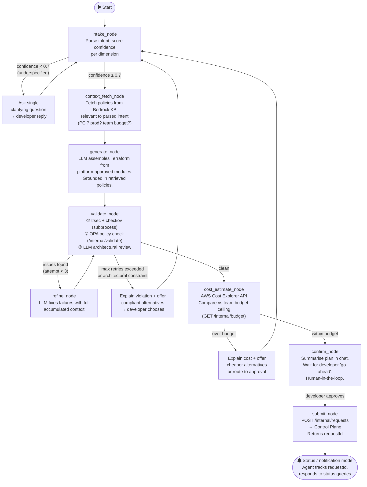
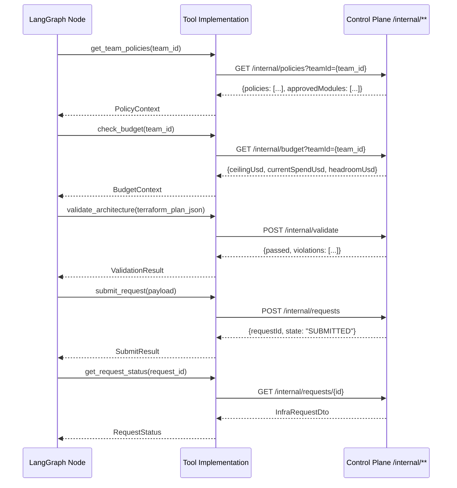
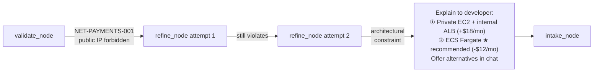

# infraforge — Chat Agent

The Chat Agent is the developer's front door. It owns the conversational loop: parsing intent, retrieving org policies via RAG, generating Terraform from approved modules, validating it, estimating cost, and handing off to the Control Plane once the developer confirms.

---

## Responsibilities

| Owns | Does NOT own |
|---|---|
| Natural language conversation | GitHub PRs / CI |
| Intent parsing + clarification | State persistence |
| Policy retrieval (Bedrock RAG) | Email notifications |
| Terraform generation (from approved modules) | Audit trail |
| Validation loop (tfsec, checkov, OPA) | |
| Cost estimation (Cost Explorer + Infracost) | |
| `submit_request()` tool call → Control Plane | |

---

## Tech Stack

| Concern | Technology |
|---|---|
| Language | Python 3.13 |
| Agent framework | LangGraph 0.3.x |
| LLM inference | LangChain-AWS → Amazon Bedrock (Claude) |
| Policy RAG | Amazon Bedrock Knowledge Bases |
| API | FastAPI 0.115.x + Uvicorn |
| HTTP client (tool calls) | httpx (async) |
| Data validation | Pydantic v2 |
| Security validation | tfsec, checkov (subprocess tool calls) |
| Cost estimation | AWS Cost Explorer API + Infracost |
| Dependency management | uv |

---

## LangGraph Graph

The agent is a **stateful, multi-node graph**. The `AgentState` TypedDict is threaded through every node; nodes return partial state updates.



---

## Node Responsibilities

| Node | Input | Output | External calls |
|---|---|---|---|
| `intake_node` | raw message | `parsed_intent`, `intent_confidence`, `clarification_needed` | LLM |
| `context_fetch_node` | `parsed_intent` | `retrieved_policies`, `team_budget_usd`, `approved_modules` | Bedrock KB, `GET /internal/policies` |
| `generate_node` | `parsed_intent` + `retrieved_policies` + `approved_modules` | `generated_terraform`, `terraform_files` | LLM |
| `validate_node` | `terraform_files` | `validation_errors`, `validation_passed` | tfsec, checkov, `POST /internal/validate` |
| `refine_node` | `validation_errors` + full state | updated `terraform_files`, `refine_attempt++` | LLM |
| `cost_estimate_node` | `terraform_files` | `estimated_monthly_cost_usd`, `cost_within_budget` | Cost Explorer, `GET /internal/budget` |
| `confirm_node` | cost summary | waits for human turn | — |
| `submit_node` | full state | `request_id`, `submitted=True` | `POST /internal/requests` |

---

## Tool Calls → Control Plane

The agent treats the Control Plane as a set of tools. All calls use `X-Service-Key` authentication and target `/internal/**`.



---

## Policy Violation Handling

When `validate_node` cannot resolve a constraint through the refine loop (architectural, not a code issue), the agent explains and offers compliant alternatives:



---

## Package Structure

```
agent/
├── pyproject.toml
├── .python-version          # 3.13
└── agent/
    ├── graph/
    │   ├── state.py         # AgentState TypedDict (full schema)
    │   ├── graph.py         # Graph topology + conditional edges (Phase 3)
    │   └── nodes/
    │       ├── intake.py          # (Phase 3)
    │       ├── context_fetch.py   # (Phase 3)
    │       ├── generate.py        # (Phase 3)
    │       ├── validate.py        # (Phase 3)
    │       ├── refine.py          # (Phase 3)
    │       ├── cost_estimate.py   # (Phase 3)
    │       ├── confirm.py         # (Phase 3)
    │       └── submit.py          # (Phase 3)
    ├── tools/
    │   ├── control_plane.py  # HTTP client wrapping /internal/** calls (Phase 3)
    │   ├── terraform_lint.py # tfsec + checkov subprocess wrappers (Phase 3)
    │   └── cost_explorer.py  # AWS Cost Explorer client (Phase 3)
    ├── ports/
    │   └── policy_store_port.py   # Abstract base — swap RAG backend
    ├── adapters/
    │   └── aws/
    │       └── bedrock_kb_adapter.py  # Bedrock Knowledge Base (Phase 3)
    ├── prompts/               # Node-level prompt templates (Phase 3)
    └── api/
        └── main.py            # FastAPI app — POST /chat (Phase 3)
```

---

## Running Locally

```bash
# Install uv (https://docs.astral.sh/uv/)
curl -LsSf https://astral.sh/uv/install.sh | sh

cd agent
uv sync                          # install all deps into .venv
uv run pytest                    # run tests (Phase 3)

# Start the agent API
uv run uvicorn agent.api.main:app --reload --port 8000
```

---

## Environment Variables

| Variable | Description |
|---|---|
| `CONTROL_PLANE_URL` | Base URL of the Control Plane (default: `http://localhost:8080`) |
| `INFRAFORGE_SERVICE_KEY` | Pre-shared key for `/internal/**` calls |
| `AWS_REGION` | AWS region for Bedrock + Cost Explorer |
| `BEDROCK_KB_ID` | Bedrock Knowledge Base ID (Phase 3) |
| `JWT_SECRET` | Shared JWT signing key — for validating UI-passed tokens |
