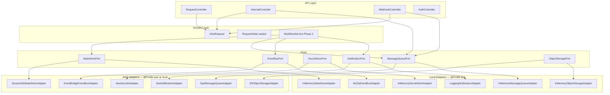
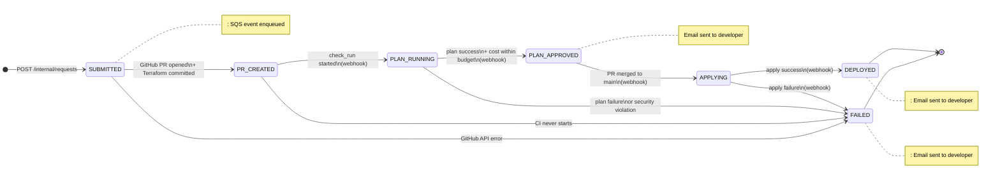
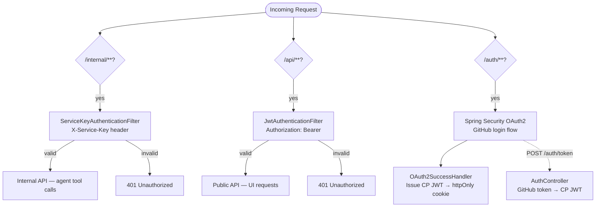
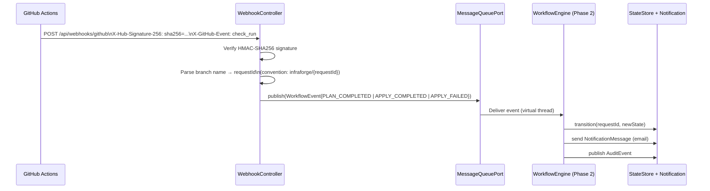

# infraforge — Control Plane

The Control Plane is the **async workflow engine** of infraforge. It runs independently of the developer's chat session and owns everything that happens after the agent calls `submit_request()`: opening a GitHub PR, monitoring CI, driving state transitions, sending email notifications, and publishing an immutable audit trail.

---

## Responsibilities

| Owns | Does NOT own |
|---|---|
| Request lifecycle state machine | LLM inference / Terraform generation |
| GitHub PR creation and CI monitoring | Conversational UX |
| Developer email notifications (SES) | Policy RAG |
| Audit event publishing (EventBridge) | |
| JWT issuance + GitHub OAuth | |
| Internal API for agent tool calls | |
| Public API for UI (request history + status) | |

---

## Tech Stack

| Concern | Technology |
|---|---|
| Language | Java 25 LTS |
| Framework | Spring Boot 3.5 |
| Build | Gradle 8.12 (version catalog: `gradle/libs.versions.toml`) |
| State machine | Spring Statemachine 4.x (Phase 2) |
| State persistence | AWS DynamoDB via SDK v2 Enhanced Client |
| Async queue | AWS SQS |
| Email | AWS SES v2 |
| Audit events | AWS EventBridge |
| Secrets | AWS Secrets Manager |
| Terraform artefacts | AWS S3 |
| Auth | GitHub OAuth 2.0 → JWT (HS256 / JJWT 0.12) |

---

## Architecture

### Hexagonal Architecture (Ports & Adapters)

The domain layer has zero AWS imports. All I/O is behind interfaces in `io.infraforge.ports`.



---

### Request State Machine

Every `InfraRequest` progresses through a sealed state hierarchy. Pattern matching at compile time makes missing transitions impossible.



---

### Authentication & Security Filter Chains

Three independent Spring Security filter chains, ordered by specificity:



---

### GitHub Webhook Flow



---

## API Reference

### Public API (`/api/**`) — JWT required

| Method | Path | Description |
|---|---|---|
| `GET` | `/api/requests` | List all requests for authenticated user |
| `GET` | `/api/requests/{id}` | Get single request status |
| `GET` | `/api/me` | Current user profile |
| `POST` | `/api/webhooks/github` | GitHub Actions webhook receiver |

### Internal API (`/internal/**`) — Service key required

| Method | Path | Description |
|---|---|---|
| `POST` | `/internal/requests` | Submit a new infra request (agent tool) |
| `GET` | `/internal/requests/{id}` | Get request status (agent tool) |
| `GET` | `/internal/policies?teamId=` | Retrieve team policies (stub → Phase 3) |
| `GET` | `/internal/budget?teamId=` | Check team budget (stub → Phase 3) |
| `POST` | `/internal/validate` | OPA policy validation (stub → Phase 3) |

### Auth (`/auth/**`) — Public

| Method | Path | Description |
|---|---|---|
| `GET` | `/auth/login` | Initiate GitHub OAuth flow |
| `GET` | `/auth/callback` | GitHub OAuth callback (Spring Security) |
| `POST` | `/auth/token` | Exchange GitHub token for CP JWT |

---

## Package Structure

```
src/main/java/io/infraforge/
├── InfraforgeApplication.java
├── domain/            # Pure domain — zero framework dependencies
│   ├── InfraRequest.java        # Immutable record
│   ├── RequestState.java        # Sealed interface + 7 nested records
│   ├── WorkflowEvent.java
│   ├── AuditEvent.java
│   ├── NotificationMessage.java
│   └── User.java
├── ports/             # Cloud-agnostic interfaces
│   ├── StateStorePort.java
│   ├── MessageQueuePort.java
│   ├── SecretStorePort.java
│   ├── EventBusPort.java
│   ├── NotificationPort.java
│   └── ObjectStoragePort.java
├── adapters/
│   ├── aws/           # AWS SDK v2 implementations
│   └── local/         # In-memory implementations (dev/test)
├── config/            # Spring @Configuration classes
│   ├── AwsClientConfig.java     # SDK clients (profile-split)
│   ├── AwsAdapterConfig.java    # Wires AWS adapters (@Profile aws,local)
│   ├── LocalAdapterConfig.java  # Wires local adapters (@Profile test)
│   ├── SecurityConfig.java      # 3 filter chains
│   └── InfraforgeProperties.java
├── auth/              # JWT, OAuth, security filters
├── api/               # REST controllers + DTOs
└── workflow/          # State machine (Phase 2)
```

---

## Running Locally

```bash
# Option A — In-memory only (no Docker needed)
./gradlew test                                    # all tests pass, zero deps

# Option B — LocalStack (realistic AWS locally)
docker compose up localstack opa                  # from repo root
./gradlew bootRun --args='--spring.profiles.active=local'

# Option C — Against real AWS
export SPRING_PROFILES_ACTIVE=aws
export AWS_REGION=us-east-1
# ... set all env vars from application-aws.yml
./gradlew bootRun
```

> **First run:** Generate the Gradle wrapper binary once:
> ```bash
> gradle wrapper --gradle-version 8.12
> ```

---

## Environment Variables

| Variable | Profile | Description |
|---|---|---|
| `GITHUB_CLIENT_ID` | all | GitHub OAuth App client ID |
| `GITHUB_CLIENT_SECRET` | all | GitHub OAuth App client secret |
| `INFRAFORGE_JWT_SECRET` | all | HS256 signing key (≥ 32 chars) |
| `INFRAFORGE_SERVICE_KEY` | all | Pre-shared key for agent auth |
| `GITHUB_APP_TOKEN` | aws | GitHub App installation token (PR creation) |
| `GITHUB_WEBHOOK_SECRET` | aws | Secret for validating GitHub webhooks |
| `DYNAMODB_TABLE` | aws | DynamoDB table name |
| `SQS_WORKFLOW_QUEUE_URL` | aws | SQS queue URL |
| `S3_TERRAFORM_BUCKET` | aws | S3 bucket for Terraform files |
| `SES_FROM_EMAIL` | aws | Verified SES sender address |
| `EVENTBRIDGE_BUS_NAME` | aws | EventBridge event bus name |
