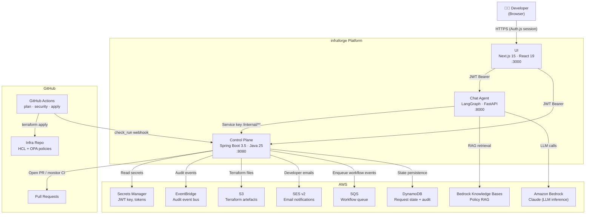
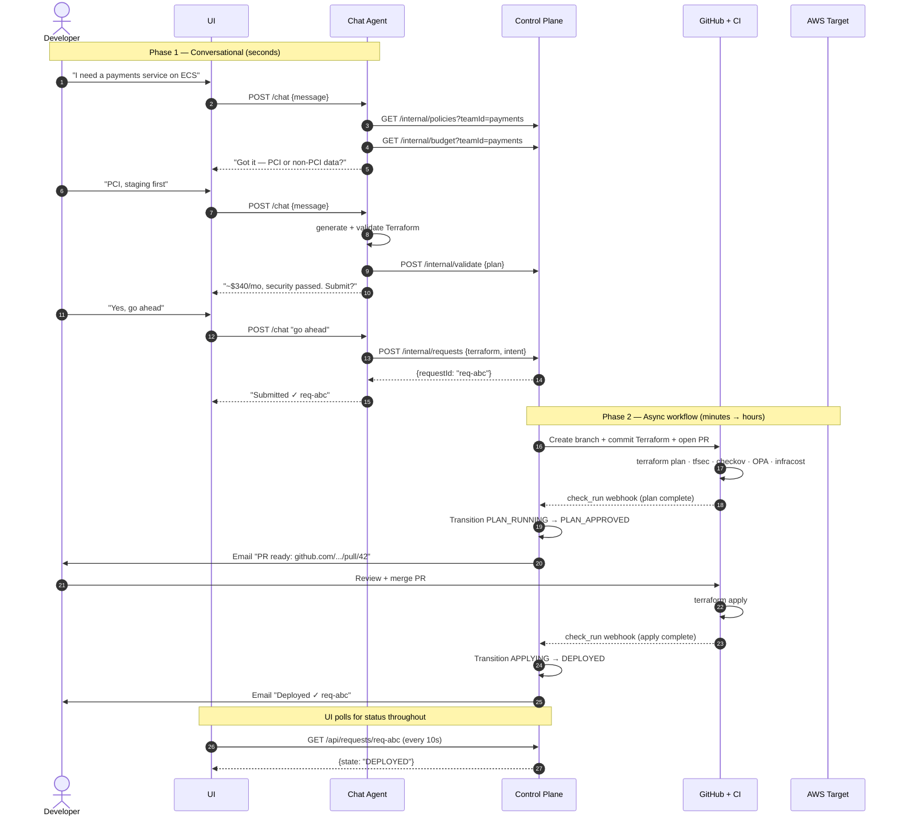
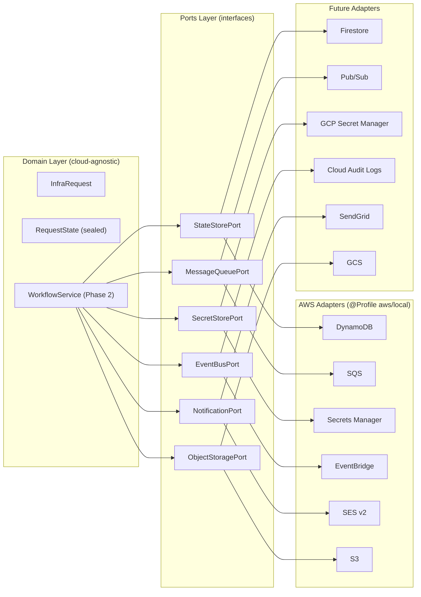
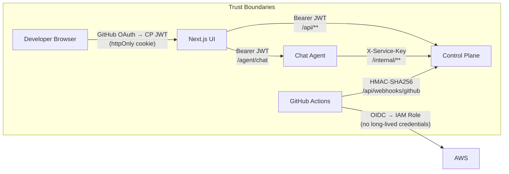

# infraforge — High-Level Architecture

## System Overview

infraforge is a chat-first Internal Developer Platform. Developers describe infrastructure in natural language; an AI agent generates policy-compliant Terraform and hands it off to an async workflow engine that owns the GitHub PR and CI/CD lifecycle.

---

## Two-Phase Model

Infrastructure provisioning spans two fundamentally different timescales. infraforge handles each with a purpose-built component.

---

## Component Responsibilities

| Component | Owns | Does NOT own |
|---|---|---|
| **Chat Agent** | Conversation, intent parsing, Terraform generation, policy RAG, cost estimation, validation loop | Async workflow, GitHub, state persistence |
| **Control Plane** | Request lifecycle state machine, GitHub PR automation, CI monitoring, email notifications, audit trail | LLM inference, Terraform generation |
| **UI** | Developer chat interface, request history display | Business logic, Terraform, CI/CD |

---

## Multi-Cloud Abstraction

The Control Plane uses **Hexagonal Architecture** (Ports & Adapters). The domain and workflow layers have zero cloud-provider imports. All I/O goes through ports.

Adding GCP support = write `GcpAdapterConfig.java` with `@Profile("gcp")`. No domain code changes.

---

## Security Model

- **No long-lived AWS credentials** anywhere — GitHub Actions uses OIDC → IAM roles
- **Plan vs apply scoping** — PR branches get read-only IAM roles; main branch gets apply permissions
- **JWT rotation** — update the Secrets Manager secret and redeploy; all old tokens rejected immediately
