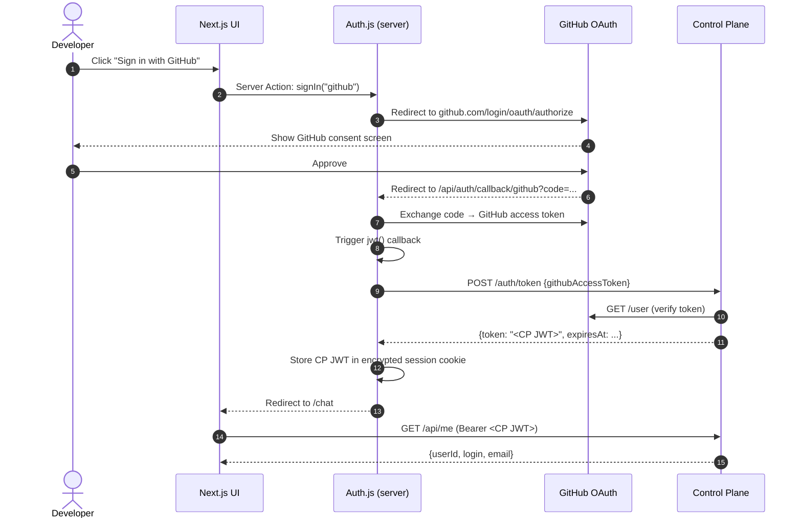
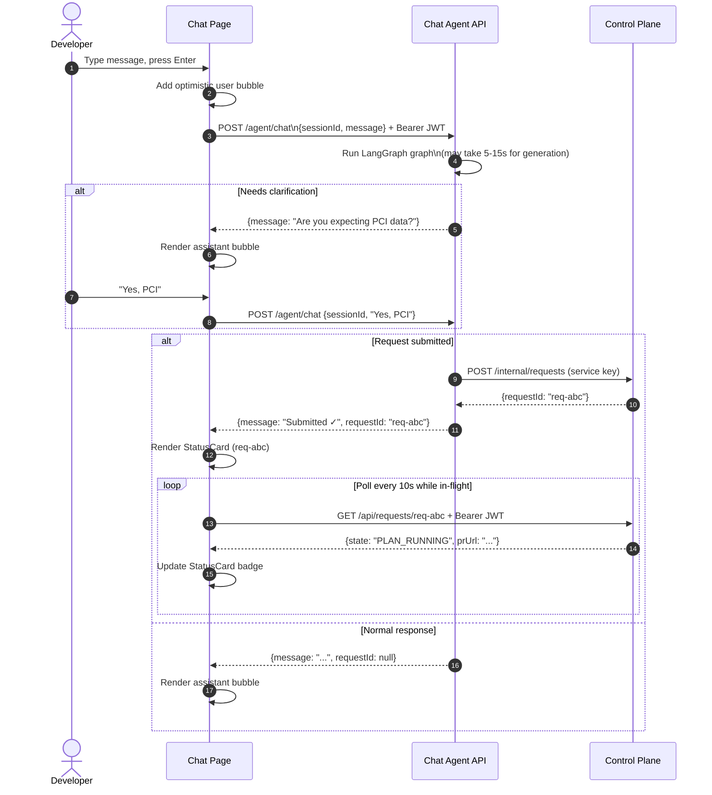
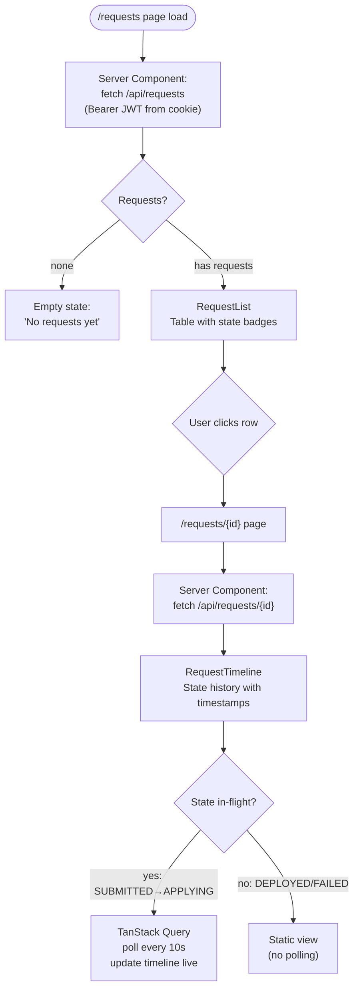
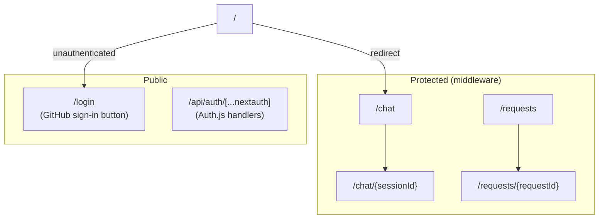
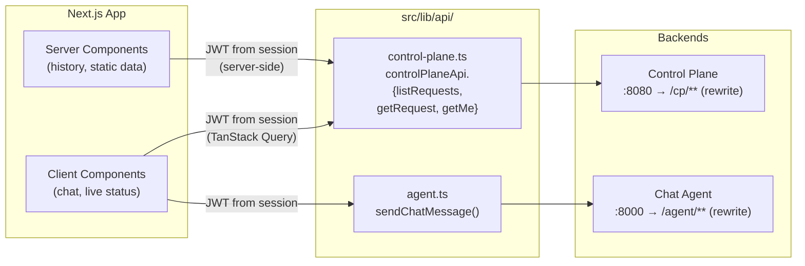

# infraforge — UI

The developer-facing web portal. Provides a chat interface to the Chat Agent and a request history dashboard backed by the Control Plane.

---

## Responsibilities

| Owns | Does NOT own |
|---|---|
| Developer chat UI | Terraform generation |
| Request history + status display | State machine |
| GitHub OAuth login flow | Email notifications |
| Polling for request status updates | Business logic |

---

## Tech Stack

| Concern | Technology |
|---|---|
| Framework | Next.js 15 (App Router) |
| UI library | React 19 |
| Language | TypeScript 5.x |
| Styling | Tailwind CSS 4 |
| Auth | Auth.js v5 (NextAuth) — GitHub provider |
| Data fetching | TanStack Query v5 (polling) |
| Markdown rendering | react-markdown + remark-gfm |
| Icons | lucide-react |

---

## Architecture

### Authentication Flow



---

### Chat Interaction Flow



---

### Request History Flow



---

### Route Structure



---

### API Client Design

The UI talks to two backends using typed clients in `src/lib/api/`:



Next.js rewrites in `next.config.ts` proxy `/cp/**` → Control Plane and `/agent/**` → Chat Agent, so the browser never needs to know the backend URLs.

---

## Package Structure

```
ui/
├── package.json
├── next.config.ts          # Rewrites: /cp/** → CP, /agent/** → agent
├── tsconfig.json
├── postcss.config.mjs      # Tailwind 4
├── .env.example
└── src/
    ├── middleware.ts        # Redirect unauthenticated users to /login
    ├── app/
    │   ├── layout.tsx
    │   ├── page.tsx         # Redirects to /chat
    │   ├── globals.css      # Tailwind + CSS variables
    │   ├── (auth)/
    │   │   └── login/
    │   │       └── page.tsx         # GitHub sign-in button
    │   ├── chat/                    # (Phase 4)
    │   │   └── [sessionId]/
    │   │       └── page.tsx
    │   ├── requests/                # (Phase 4)
    │   │   ├── page.tsx
    │   │   └── [requestId]/
    │   │       └── page.tsx
    │   └── api/
    │       └── auth/
    │           └── [...nextauth]/
    │               └── route.ts     # Auth.js route handler
    ├── components/                  # (Phase 4)
    │   ├── chat/
    │   │   ├── ChatInput.tsx
    │   │   ├── MessageBubble.tsx
    │   │   └── StatusCard.tsx       # Embedded request status in chat
    │   └── requests/
    │       ├── RequestList.tsx
    │       └── RequestTimeline.tsx
    └── lib/
        ├── auth.ts          # Auth.js config: GitHub → CP JWT exchange
        └── api/
            ├── control-plane.ts  # Typed CP API client
            └── agent.ts          # Typed agent API client
```

---

## Running Locally

```bash
cd ui
cp .env.example .env.local
# Fill in GITHUB_CLIENT_ID, GITHUB_CLIENT_SECRET, AUTH_SECRET

npm install
npm run dev     # http://localhost:3000

# Type checking
npm run type-check
```

**GitHub OAuth App setup:**
1. Go to GitHub → Settings → Developer settings → OAuth Apps → New OAuth App
2. Homepage URL: `http://localhost:3000`
3. Authorization callback URL: `http://localhost:3000/api/auth/callback/github`

---

## Environment Variables

| Variable | Description |
|---|---|
| `GITHUB_CLIENT_ID` | GitHub OAuth App client ID |
| `GITHUB_CLIENT_SECRET` | GitHub OAuth App client secret |
| `AUTH_SECRET` | Auth.js session encryption key (`openssl rand -base64 32`) |
| `CONTROL_PLANE_URL` | Control Plane base URL (default: `http://localhost:8080`) |
| `AGENT_API_URL` | Chat Agent base URL (default: `http://localhost:8000`) |
